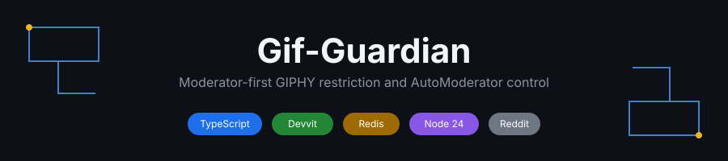
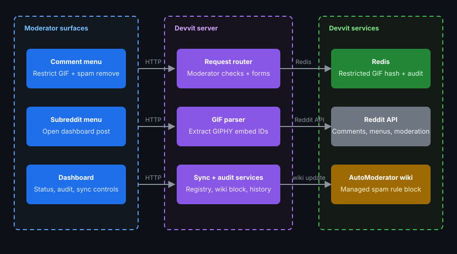
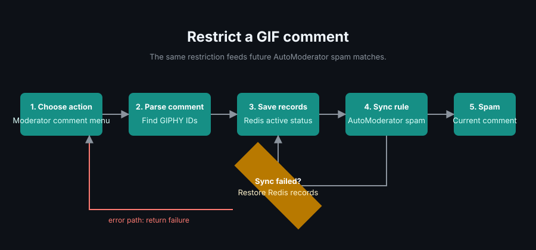

# Gif-Guardian

<p align="center">
  
</p>

<p align="center">
  <a href="package.json"></a>
  <a href="LICENSE"></a>
  <a href=".github/workflows/ci.yaml"></a>
  
  
</p>

Gif-Guardian helps subreddit moderators restrict unwanted GIPHY GIFs once and keep future matching comments out with AutoModerator spam rules.

## What is this?

Gif-Guardian is a moderator-focused Devvit app for Reddit. A moderator can select a comment containing one or more supported GIPHY embeds, record those GIF IDs in Redis, synchronize a managed AutoModerator block, and spam-remove the current comment.

There is no custom dashboard or custom post UI. All moderator interaction happens through native Devvit menu actions and forms.

## Why does this exist?

GIF moderation becomes repetitive when the same unwanted GIF keeps appearing. Gif-Guardian turns the first moderation action into reusable desired state:

1. The GIF ID is stored in Redis.
2. Redis becomes the source of truth for active and disabled restrictions.
3. AutoModerator is synchronized from the active Redis records.
4. The current comment is spam-removed.
5. The action is written to the audit log.

AutoModerator is treated as a projection of Redis state, not the primary data store.

## Features

- Moderator-only comment and subreddit menu actions.
- GIPHY embed ID extraction with duplicate removal.
- Redis-backed restricted GIF registry.
- Active and disabled GIF states.
- Managed AutoModerator rule generation using `action: spam`.
- Transactional registry updates with revision tracking.
- AutoModerator synchronization with an expiring Redis lease.
- Source-comment and source-post reference indexes.
- Redis-backed audit history with retention.
- Idempotency claims for repeated moderation requests.
- Desired-state retention when AutoModerator synchronization fails.

## Architecture

<p align="center">
  
</p>

```text
Reddit moderator action
        |
        v
  Devvit server
        |
        +----------------------+
        |                      |
        v                      v
      Redis              Reddit comment
        |                      |
        |                      +--> spam removal
        |
        +--> desired GIF state
        |
        +--> revision state
        |
        +--> audit history
        |
        v
  AutoModerator sync
        |
        v
config/automoderator
```

The managed AutoModerator section is bounded by:

```text
# === COCONAAD GIF GUARD START ===
...
# === COCONAAD GIF GUARD END ===
```

Only that marked section is replaced by Gif-Guardian. Other AutoModerator configuration remains outside the managed block.

## How it works

<p align="center">
  
</p>

1. A moderator chooses **Gif-Guardian: Restrict GIF** on a comment.
2. The app extracts the supported GIPHY IDs and opens the native restriction form.
3. The submitted records are written to Redis in one transaction.
4. The desired registry revision becomes pending.
5. AutoModerator is synchronized from the current active GIF registry.
6. The current comment is spam-removed.
7. The result is audited and shown to the moderator.

If AutoModerator synchronization fails, the Redis desired state is retained. A later **Gif-Guardian: Sync AutoModerator** action can reconcile the projection.

## Moderator controls

### Restrict a GIF

From a comment containing a supported embed:

```text
Gif-Guardian: Restrict GIF
```

The form accepts a reason and then:

```text
Redis mutation
      ->
AutoModerator synchronization
      ->
Spam removal
      ->
Audit record
```

The default moderation reason is `pookie_cm`.

### Manage restricted GIFs

From the subreddit moderator menu:

```text
Gif-Guardian: Manage Restricted GIFs
```

Choose a registry record and either:

- **Disable** the restriction, or
- **Restore** the restriction.

Disabled records remain in Redis but are excluded from the active AutoModerator block.

### Synchronize AutoModerator

From the subreddit moderator menu:

```text
Gif-Guardian: Sync AutoModerator
```

This reconciles the managed AutoModerator block with the current Redis desired state without changing unrelated AutoModerator configuration.

## Data model

A restricted GIF record has this shape:

```json
{
  "giphyId": "example",
  "status": "active",
  "reason": "pookie_cm",
  "firstAddedAt": "2026-09-19T00:00:00.000Z",
  "firstAddedBy": "moderator",
  "lastActionAt": "2026-09-19T00:00:00.000Z",
  "lastActionBy": "moderator",
  "sourceComment": "t1_example",
  "sourceUrl": "https://www.reddit.com/...",
  "sourcePost": "t3_example"
}
```

Legacy records containing `addedAt`, `addedBy`, and `originalUrl` are normalized by the runtime validator.

## Redis state

The application uses installation-scoped Redis keys:

| Key | Purpose |
| --- | --- |
| `gif-guardian:restricted-gifs` | Restricted GIF hash |
| `gif-guardian:state` | Desired and synchronized revision state |
| `gif-guardian:source-comments` | Comment-to-GIF source references |
| `gif-guardian:source-posts` | Post-to-GIF source references |
| `gif-guardian:automod-lock` | AutoModerator synchronization lease |
| `gif-guardian:audit` | Audit sorted set |
| `gif-guardian:audit:sequence` | Audit sequence number |
| `gif-guardian:action:<commentId>` | Temporary idempotency claim |

The important registry invariant is:

```text
0 <= syncedRevision <= desiredRevision
```

A mutation increments `desiredRevision` and marks synchronization as pending. A worker can only mark a revision synchronized if that exact desired revision is still current when the projection is verified.

## AutoModerator rules

Active GIF IDs are packed into rules based on serialized UTF-8 rule size rather than an arbitrary ID count.

Each managed rule uses:

```yaml
type: comment
body (includes, regex): '(?:|[^)]*)?)'
action: spam
action_reason: "pookie_cm"
moderators_exempt: false
```

The actual stored rule contains the required regex escaping for the AutoModerator configuration.

## API routes

All application routes are `POST` routes.

| Route | Purpose |
| --- | --- |
| `/internal/menu/restrict-gif` | Validate the moderator, inspect the current comment, and open the native restriction form |
| `/internal/menu/manage-restricted-gifs` | Open the native restricted-GIF management form |
| `/internal/menu/sync-automod` | Manually reconcile AutoModerator with Redis |
| `/internal/form/restrict-gif-submit` | Persist restrictions, synchronize AutoModerator, remove the comment, and audit the action |
| `/internal/form/manage-restricted-gifs-submit` | Disable or restore a registry record and synchronize AutoModerator |
| `/internal/triggers/comment-delete` | Remove a deleted comment from the source-reference index |
| `/internal/triggers/post-delete` | Remove a deleted post from the source-reference index |

Moderator-facing routes perform a server-side moderator check even though the Devvit menu configuration is already restricted to moderators.

## Project structure

```text
.
├── devvit.json
├── package.json
├── docs/
│   └── assets/
│       ├── banner.svg
│       ├── architecture.svg
│       └── flow.svg
├── src/
│   ├── server/
│   │   ├── index.ts
│   │   ├── server.ts
│   │   ├── automod.ts
│   │   ├── audit.ts
│   │   ├── gif-parser.ts
│   │   ├── gif-store.ts
│   │   ├── gif.ts
│   │   ├── state.ts
│   │   └── validation.ts
│   ├── shared/
│   │   └── index.ts
│   └── test/
├── .github/
│   └── workflows/
│       └── ci.yaml
├── LICENSE
└── README.md
```

There is no dashboard HTML, dashboard JavaScript, custom dashboard post, or dashboard API.

## Tech stack

| Technology | Role |
| --- | --- |
| TypeScript 7 | Server and shared types |
| Devvit Web 0.14 | Reddit runtime, menus, forms, Redis, and Reddit APIs |
| Node.js 24 | Runtime and test execution |
| Redis through Devvit | Registry, state, source references, idempotency, and audit storage |
| esbuild | Server bundling |
| Biome | Formatting and linting |
| Node test runner | Unit tests |

## Getting started

### Prerequisites

- Node.js 24 or newer.
- A Reddit account with access to the Devvit developer workflow.
- A test subreddit where you have moderator permissions.
- Redis and Reddit permissions enabled in `devvit.json`.

### Installation

```bash
npm install --no-fund
```

### Configuration

There are no application environment variables.

The development subreddit currently configured in `devvit.json` is:

```text
TestEnvironmentAlpha
```

Change that value before using the app in another development subreddit.

### Validation

Run everything:

```bash
npm test
```

The command runs:

```text
TypeScript build
    ->
Biome
    ->
unit tests
    ->
production server build
```

Run individual checks when debugging:

```bash
npm run test:types
npm run lint
npm run test:unit
npm run build
```

### Playtest

```bash
npm run playtest
```

## Development notes

Redis transactions are used whenever a mutation depends on reading, checking, and writing shared state.

The registry transaction watches:

```text
GIF registry
comment source index
post source index
registry state
```

The AutoModerator lease is token-owned and expiring. Lease renewal and release use Redis transactions so an expired lease cannot be deleted by an old worker after another worker has acquired it.

AutoModerator synchronization also rechecks the registry revision before writing and after writing. If the desired revision keeps changing, the sync remains pending instead of declaring an older snapshot synchronized.

## Testing

The current unit suite covers:

- GIPHY ID extraction.
- Duplicate GIPHY ID removal.
- Extended GIPHY embeds.
- Registry validation.
- Legacy registry normalization.
- Managed AutoModerator block replacement.
- Empty managed AutoModerator blocks.
- Duplicate and reversed AutoModerator markers.
- AutoModerator rule-size packing.

The Redis concurrency paths are implemented against Devvit's transaction API and should be exercised in playtests against the installation-scoped Redis store.

## Contributing

1. Make a focused change.
2. Run `npm test`.
3. Playtest moderator workflows in `TestEnvironmentAlpha`.
4. Keep Gif-Guardian changes inside the marked AutoModerator block.
5. Preserve Redis as the desired-state source of truth.

## Roadmap

- [x] Restrict GIPHY IDs from moderator comment actions.
- [x] Persist active and disabled GIF records.
- [x] Synchronize a managed AutoModerator block.
- [x] Use revision-aware desired-state tracking.
- [x] Remove the custom dashboard in favor of native moderator menus and forms.
- [x] Harden Redis read/modify/write paths with transactions.
- [x] Add duplicate and malformed AutoModerator marker checks.
- [ ] Add dedicated coverage reporting to CI.
- [ ] Document a complete Devvit playtest walkthrough.

## License

Gif-Guardian is licensed under the [BSD-3-Clause License](LICENSE).
